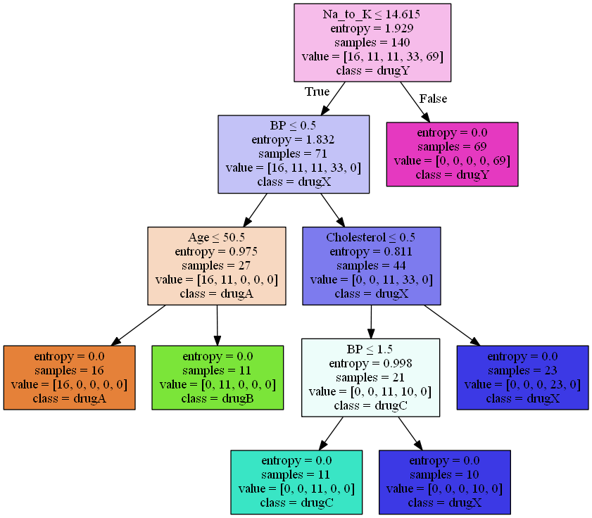

# Drugs classification using Decision Tree

 

## Table of contents

- [Objective](#Objective)
- [Overview](#Overview)
- [Technologies Used ](#technologies-used)
- [Methodology](#Methodology)
- [Results](#Results)

## Objective
[(Back to top)](#Table-of-contents)

The  objective of the project is to create a classification model able  to predict the class of an unknown patient or find a proper drug for a new patient. 

## Overview

[(Back to top)](#Table-of-contents)

ML Decision Tree program  use a classification algorithm(Decision Tree) to build a model from historical data of patients, and their response to different medications
to predict the class of an unknown patient or find a proper drug for a new patient.

## Technologies used

[(Back to top)](#Table-of-contents)

## Methodology
[(Back to top)](#Table-of-contents)

*  Dataset 

    Imagine that you are a medical researcher compiling data for a study. You have collected data about a set of patients, all of whom suffered from the same illness. During their course of treatment, each patient responded to one of 5 medications, Drug A, Drug B, Drug c, Drug x and y.
    Part of your job is to build a model to find out which drug might be appropriate for a future patient with the same illness. The feature sets of this dataset are Age, Sex, Blood Pressure, and Cholesterol of patients, and the target is the drug that each patient responded to.
    It is a sample of multiclass classifier, and you can use the training part of the dataset to build a decision tree, and then use it to predict the class of a unknown patient, or to prescribe it to a new patient

* Data Preprocessing
* Modeling (DecisionTree)
* Getting predictions
* Vizualising the prediction tree

## Results
[(Back to top)](#Table-of-contents)

### Model Acuracy :
  0.93333 (93% average good predictions on testing dataset)
### Data Decision Tree 

